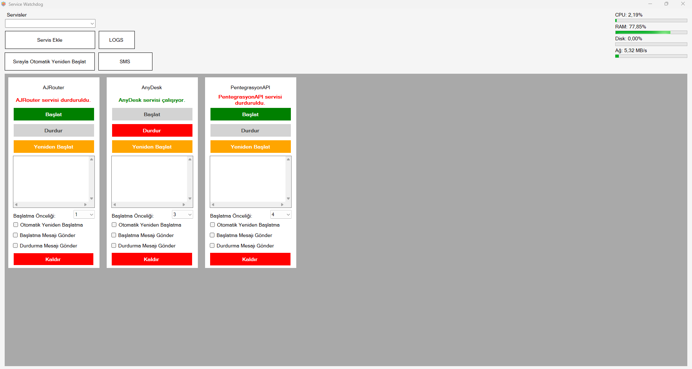

# Service Watchdog

## Hakkında

Bu proje, WinForms kullanılarak geliştirilen bir Windows servis yönetim aracıdır. Kullanıcıların Windows servislerini eklemesine ve kontrol etmesine olanak tanır; başlatma, durdurma, yeniden başlatma, durduğunda otomatik başlatma ve sıralı başlatma gibi işlevler sunar. Ayrıca, servis durumu değişikliklerinde SMS bildirimleri gönderir ve CPU, RAM, disk ve ağ kullanımı hakkında anlık bilgi gösterir.

## Ekran Görüntüsü


## Özellikler

- **Servis Yönetimi**: Windows servislerini ekleme, başlatma, durdurma, yeniden başlatma ve yönetme.
- **Otomatik Yeniden Başlatma**: Beklenmedik şekilde duran servisleri otomatik olarak yeniden başlatma.
- **Sıralı Başlatma**: Servisleri belirli bir sırayla başlatma.
- **SMS Bildirimleri**: Servis durumu değişikliklerinde SMS bildirimleri gönderme.
- **Gerçek Zamanlı İzleme**: CPU, RAM, disk ve ağ kullanımı hakkında anlık bilgi gösterme.

## Kullanılan Teknolojiler

- **C# WinForms**: Masaüstü uygulama arayüzü oluşturmak için kullanılan framework.
- **.NET Framework/Core**: Arka plan mantığı ve işlemler.
- **Üçüncü Parti Kütüphaneler**: SMS bildirimleri ve sistem izleme için kullanılan kütüphaneler.
- **Visual Studio**: Geliştirme için kullanılan entegre geliştirme ortamı.

## Kurulum

1. **Depoyu Klonlayın**:
    ```sh
    git clone https://github.com/BeratARPA/Service-Watchdog.git
    ```
2. **Visual Studio ile Açın**: Projeyi Visual Studio'da açın.
3. **Bağımlılıkları Yükleyin**: Gerekli bağımlılıkları geri yükleyin.
4. **Projeyi Derleyin**: Doğru kurulum için çözümü derleyin.
5. **Projeyi Çalıştırın**: Projeyi çalıştırmak ve servis yönetim arayüzüne erişmek için F5'e basın.

## Kullanım

1. **Uygulamayı Başlatın**: Uygulamayı Visual Studio'dan veya çalıştırılabilir dosyadan başlatın.
2. **Servisleri Ekleyin**: Yönetmek istediğiniz Windows servislerini ekleyin.
3. **Servisleri Kontrol Edin**: Servisleri başlatmak, durdurmak, yeniden başlatmak veya otomatik yeniden başlatma ayarlamak için arayüzü kullanın.
4. **Bildirimleri Ayarlayın**: Servis durumu değişiklikleri için SMS bildirimlerini yapılandırın.
5. **Sistemi İzleyin**: Anlık CPU, RAM, disk ve ağ kullanımını görüntüleyin.

## Katkıda Bulunma

Katkıda bulunmak isterseniz, lütfen depoyu forklayın, bir özellik dalı oluşturun ve bir pull request gönderin.

## Lisans

Bu proje MIT Lisansı altında lisanslanmıştır. Daha fazla bilgi için [LICENSE](LICENSE) dosyasına bakın.

## İletişim

Sorularınız veya geri bildirimleriniz için benimle iletişime geçebilirsiniz:
- **E-posta**: [beratarpa@hotmail.com](mailto:beratarpa@hotmail.com)
- **GitHub**: [https://github.com/BeratARPA)](https://github.com/BeratARPA)
